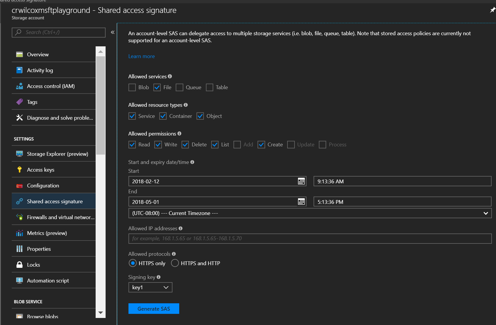

# Azure Files FUSE Driver
## Enables using SAS Tokens for mounting Azure Files shares

[](https://travis-ci.org/crwilcox/AzureFilesFUSE)

### Motivation
I wanted to be able to use Shared Access Signature (SAS) Tokens for connecting to file shares. Microsoft Azure Files provides CIFS/SMB mounting but, unfortunately, only mounting via Account Key is supported.

### But why would I care about mounting via SAS instead of Account Primary/Secondary key?
Azure Storage primary and secondary keys grant full read/write/delete access to that storage account. This means that the machine with the SMB/CIFS mount, if somehow was compromised, the secret present would gain broader access to Azure than the CIFS/SMB mount ever had leveraged. This violates the principle of least privilege. For this reason, I created this project. 

## Using Azure Files FUSE Driver

### Quick Setup (Assumes Ubuntu 16.04 LTS or similar)
```
sudo apt-get -y install python3 python3-pip fuse
sudo pip3 install -r requirements.txt
/bin/mkdir <mount_point>
sudo python3 azfilesfuse.py <azure_storage_account> <azure_file_share_name> <sas_token> <mount_point>
```

### System Requirements
The system needs Python 3.5 (or greater) and FUSE libraries to run. I expect to start using 3.6 syntax in the future so I suggest using 3.6 or greater, though it isn't strictly required at this time.

NOTE: This is primarily tested agains Ubuntu 16.04 LTS. Other platforms should work with the below steps, but they are not verified frequently.

#### Ubuntu 16.04 LTS
```
sudo apt-get -y install python3 python3-pip fuse
```

#### RHEL 6.3
Install Python 3 following https://tecadmin.net/install-python-3-6-on-centos/. Verify the latest python release (at the time of writing this, 3.6.2, not 3.6.1, is current)

Install other packages
```
yum install fuse-libs
yum install zlib-devel
yum install openssl-devel
```

### Python Dependencies
This package leverages a few python packages Some of them in requirements are only needed if you intend to debug or run the unit tests.

#### Packages needed to run
- azure
- fusepy
- requests
- python-dateutil

#### Packages needed to develop
- vcrpy
- ptvsd

### Example Usage
sudo -H -u username python3 azfilesfuse.py 'crwilcoxteststorage' 'testshare' 'se=2017-07-16T20%3A42%3A33Z&sp=rwdl&sv=2016-05-31&sr=s&sig=C/N0tRE%AlLYaKeyD' 'testmount'

## Additional Notes
I am currently using this on Ubuntu 16.04 LTS but it should work on many other Linux platforms. I will try to update the platforms section to reflect platforms I have heard work.

## Running Tests
This project contains some tests. Most of these steps will only have to be run once.

1) Create new Azure Table Storage Account to use for testing. [How-to](https://docs.microsoft.com/en-us/azure/storage/common/storage-quickstart-create-account?tabs=portal)

2) Create a file share in the Azure Table Storage Account you created. Configure this share to have a quota. A reasonable quota would be 100MB to 1GB. [How-to](https://docs.microsoft.com/en-us/azure/storage/files/storage-how-to-create-file-share#create-file-share-through-the-azure-portal)

3) Create an account SAS token. Take special care to make this off of the account. Some of the tests use the quota property which isn't accessible from the share itself, but is available account-wide. You can restrict this to only have access to the file service.


4) Now that the necessary Azure components are created, some environment variables need to be set. 
    - azfilesfuse_test_accountname is the name of the storage account (step 1)
    - azfilesfuse_test_accountshare is the name of the file share (step 2)
    - azfilesfuse_test_accountsastoken is the sas token created (step 3).

5) Run the tests: `python -m unittest`


